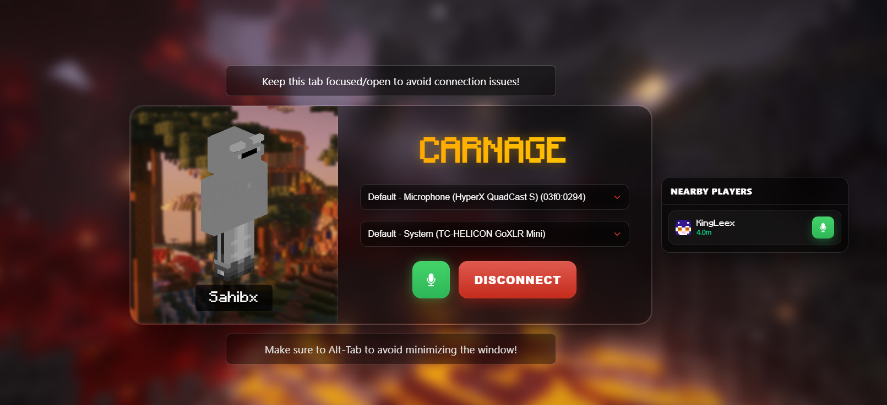

<h1 align="center">Carnage Proximity Chat</h1>

<p align="center">
  
</p>

A fun side project I built a few months ago to explore proximity-based voice chat. It lets players talk to each other based on how close they are in the virtual space.

---

### ⚠️ Audio Notice
Spatial audio can sometimes glitch or break when new users join the session. It’s a known issue but shouldn’t be too difficult to troubleshoot if you’re comfortable with audio/video streaming.

### 🔒 Security & State Management
This was my first attempt at building something like this, so the way player sessions and states are managed isn’t fully production-grade or secure. Consider it a proof-of-concept — please strengthen the authentication and state handling before deploying it in any serious environment.

### 🛠️ Server Jar Access
I no longer have access to the original server JAR. However, if you know what you're doing, recreating the server and setting everything up should take no more than 10–15 minutes.

---

## Getting Started

### Prerequisites
- Node.js installed (v14+ recommended)
- A TURN server configured (add your credentials to the `.env` file)

### Installation
1. Clone this repository:
    ```bash
    git clone <repo-url>
    ```
2. Install dependencies:
    ```bash
    npm install
    ```
3. Configure environment variables by creating a `.env` file with your TURN server details.

### Running the App
Start the development server with:
```bash
npm start